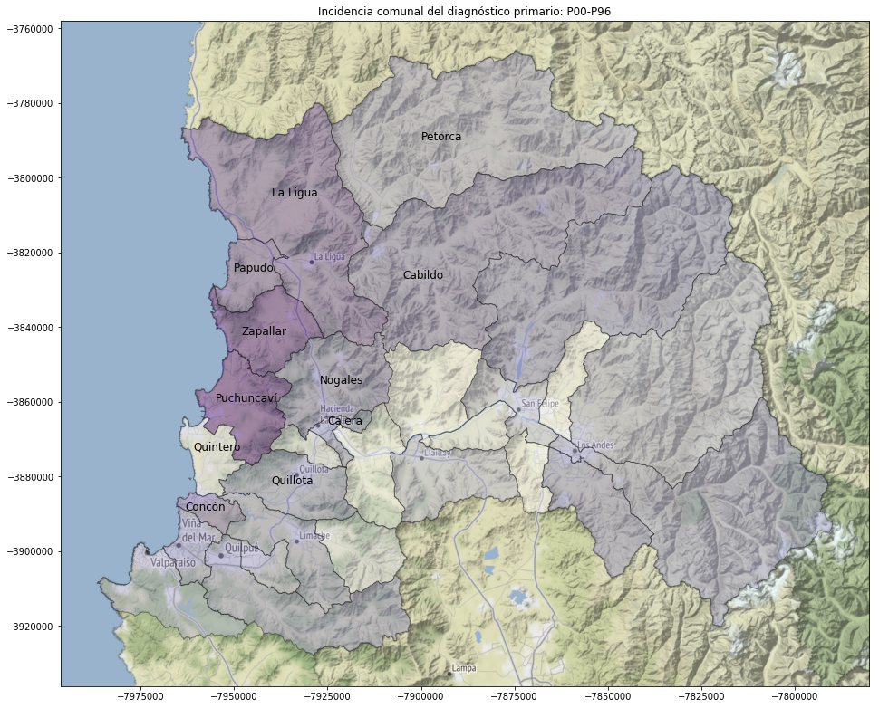
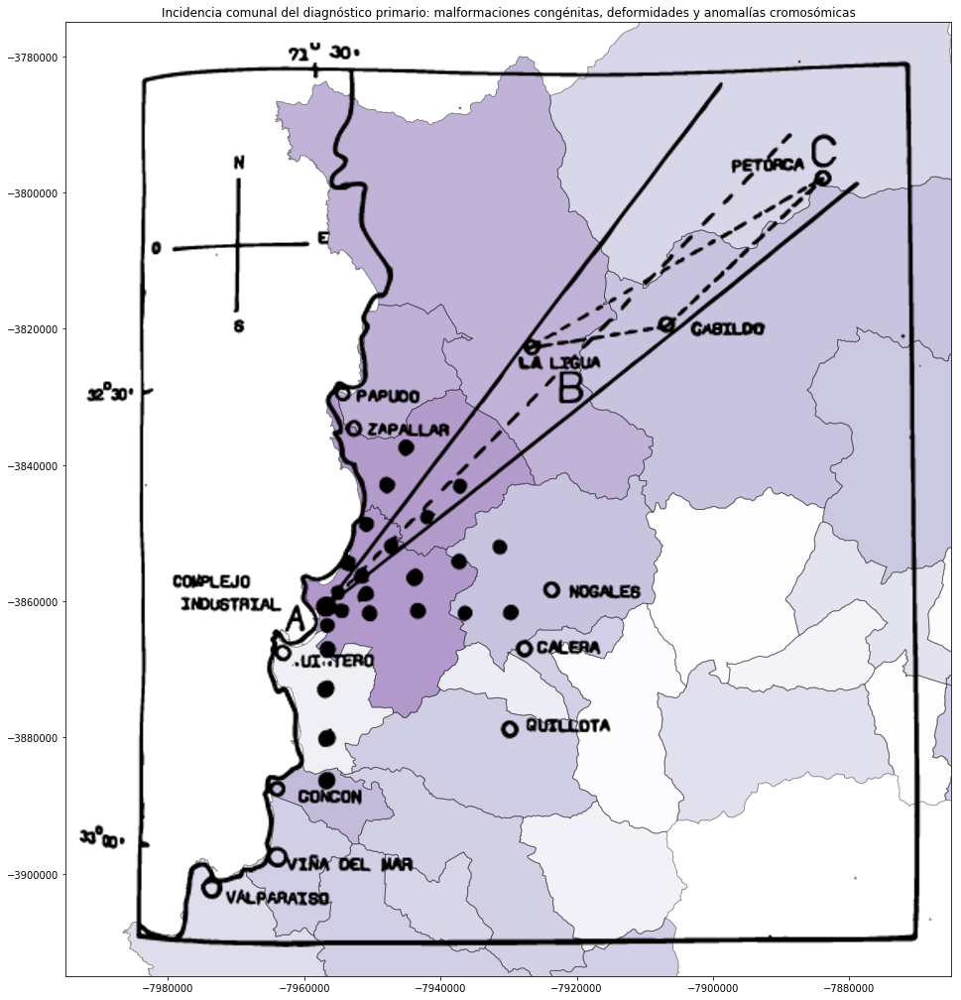

<!--
### Meta 

Este archivo está disponible en 3 versiones: 

 - [jupyter notebook original](readme.ipynb) (avanzado)
 - [html distribuible](../../raw/master/readme.html) (intermedio: click derecho descargar archivo )
 - mark down online (simplificado: es este archivo) 
 
___ 
# Lenguaje de programación y testeo estadístico: el caso de Ventanas 

-->
## Una comparativa entre la zona crítica y el resto de Chile 
### Introducción 
Mediante programación en _Python_ fue estandarizar  los registros de defunciones oficiales, que tienen una serie de variaciones año a año. Una vez construida una [unificación de los registros de defunciones en Chile, entre el año 1998 y 2016](https://github.com/verasativa/defunciones-decoder), surge la pregunta general: ¿Se podrán observar en éste, rasgos distintos en una zona crítica al resto de Chile? Utilizando el mismo lenguaje de programación testearemos esa hipótesis.

### Antecedentes
El impacto ambiental y a la salud humana del complejo industrial Quintero-Ventanas ha sido ampliamente documentado al punto de que el Colegio Medico chileno, dedicara un numero completo de su revista de salud pública _Cuadernos Médico Sociales_ [@cms59]

Internacionalmente _The Lancet Commission on pollution and health_  dice que la polución del aire puede ser vinculada al aumento de nacimientos prematuros y con bajo peso. Y que algunos estudios han mostrado asociación entre polución ambiental del aire y aumento del riesgo del síndrome de muerte súbita del lactante [@landrigan2017].

### Comparación de diagnósticos primarios
Apalancándose en la integración jerárquica, de los códigos de diagnóstico CIE-10 en el dataset. Una comparación de éstos, se presenta como la opción más evidente y atractiva, pero con algunas consideraciones.

### Limitaciones
Dado que este dataset solo incluye las defunciones, y no contiene información sobre la población general, no es posible hacer un análisis respecto a tasas de ocurrencia, sin tener que argumentar con otros datos como censos. Además la ruralidad de la zona, conjugada con la migración campo-ciudad, produce una población envejecida. Tampoco podemos hacer un análisis sobre la distribución etaria de la mortalidad, ni la distribución de diagnósticos primarios en la población general, sin normalizar primero con datos adicionales.

### Pregunta de investigación
Con esas limitaciones en mente, podemos plantear una pregunta sencilla, pero contestable:

__¿Como se comparan los diagnósticos primarios de defunciones, en la zona de interés con respecto al resto del país, en menores de 16 años?__

### Proceso exploratorio: definiendo la "zona de interés"
Inicialmente se exploró, como zona de interés solamente las comunas de Quintero y Puchuncaví, razón de ser las directamente colindates con el foco industrial de contaminación.

```
Zona de interés: ['Quintero', 'Puchuncaví']
Total defunciones en el grupo de interés: 119
Total defunciones en los 10 principales diagnósticos primarios del grupo de interés: 118
Fracción del total: 0.992
```

.png "Figura 1: Distribución de los 10 mayores diagnósticos primarios en defunciones de menores de 16 años (Quintero-Puchuncaví)")


Sin embargo, podemos observar en la figura 1, que hay dos diagnósticos primarios que presentan incidencias superiores a la nacional, con la intención de buscar una tendencia más clara y validable (tamaño de la muestra), exploramos la incidencia de estos dos diagnósticos primarios en todas las comunas de la quinta región.

### Ciertas afecciones originadas en el período perinatal (P00-P96)

|   # | Comuna      |   Incidencia comuna |   Incidencia otros |   Taza comuna |   Taza otros |   Total comuna |   Total otros |
|-----|-------------|---------------------|--------------------|---------------|--------------|----------------|---------------|
|   0 | La Cruz     |                  26 |              15957 |      0.509804 |     0.274836 |             51 |         58060 |
|   1 | Rinconada   |                  15 |              15968 |      0.46875  |     0.274936 |             32 |         58079 |
|   2 | San Felipe  |                 109 |              15874 |      0.37457  |     0.274542 |            291 |         57820 |
|   3 | Olmué       |                  17 |              15966 |      0.369565 |     0.274968 |             46 |         58065 |
|   4 | El Tabo     |                   7 |              15976 |      0.368421 |     0.275012 |             19 |         58092 |
|   5 | San Esteban |                  15 |              15968 |      0.357143 |     0.274983 |             42 |         58069 |
|   6 | Cartagena   |                  18 |              15965 |      0.339623 |     0.274984 |             53 |         58058 |
|   7 | Llaillay    |                  28 |              15955 |      0.337349 |     0.274953 |             83 |         58028 |
|   8 | Calle Larga |                  13 |              15970 |      0.333333 |     0.275003 |             39 |         58072 |
|   9 | Algarrobo   |                  11 |              15972 |      0.323529 |     0.275014 |             34 |         58077 |
|  10 | Quintero    |                  23 |              15960 |      0.315068 |     0.274992 |             73 |         58038 |
|  11 | Hijuelas    |                  23 |              15960 |      0.310811 |     0.274997 |             74 |         58037 |

### Malformaciones congénitas, deformidades y anomalías cromosómicas (Q00-Q99)

|   # | Comuna       |   Incidencia comuna |   Incidencia otros |   Taza comuna |   Taza otros |   Total comuna |   Total otros |
|-----|--------------|---------------------|--------------------|---------------|--------------|----------------|---------------|
|   0 | Puchuncaví   |                  20 |              15428 |      0.434783 |     0.265702 |             46 |         58065 |
|   1 | Zapallar     |                   6 |              15442 |      0.428571 |     0.265797 |             14 |         58097 |
|   2 | Papudo       |                   3 |              15445 |      0.375    |     0.265821 |              8 |         58103 |
|   3 | La Ligua     |                  37 |              15411 |      0.37     |     0.265657 |            100 |         58011 |
|   4 | Concón       |                  30 |              15418 |      0.352941 |     0.265708 |             85 |         58026 |
|   5 | Nogales      |                  20 |              15428 |      0.333333 |     0.265766 |             60 |         58051 |
|   6 | Cabildo      |                  20 |              15428 |      0.333333 |     0.265766 |             60 |         58051 |
|   7 | Putaendo     |                  19 |              15429 |      0.322034 |     0.265779 |             59 |         58052 |
|   8 | El Tabo      |                   6 |              15442 |      0.315789 |     0.26582  |             19 |         58092 |
|   9 | Quillota     |                  78 |              15370 |      0.3083   |     0.26565  |            253 |         57858 |
|  10 | Calle Larga  |                  12 |              15436 |      0.307692 |     0.265808 |             39 |         58072 |
|  11 | Viña del Mar |                 287 |              15161 |      0.304671 |     0.265196 |            942 |         57169 |

Al observar las tablas de incidencia, podemos notar que el diagnóstico primario _Ciertas afecciones originadas en el período perinatal_, está dominado por otras comunas, y no primariamente las de la zona de interés. Y por otra parte el diagnóstico primario de _Malformaciones congénitas, deformidades y anomalías cromosómicas_ domina en comunas colindantes al centro industrial.
Ante esto, decidimos graficar la incidencia de interés en el mapa.



### Se observa una distribución no-radial: ¿Cómo se explica?

En la figura 2 se puede apreciar que las comunas más afectadas parecen ser las directamente al norte (Puchuncaví, Zapallar, Papudo y La Ligua), al este (Nogales, La Calera y Quillota) e incluso directamente al sur Con-con. 

Al observar esta distribución no radial, la investigación parecía no tener sentido y se estancó durante un tiempo. Se sospechaba de un patrón de vientos, pero fue necesario que se nos refiriera la investigación de Patricio Cornejo, Juan López y Sergio Romano 1983 [@cms80s], donde se creó un mapa que indica la dispersión de contaminación, desde el complejo industrial Quintero-Ventanas. 

Al sobreponer ese mapa sobre nuestras incidencias (Figura 3), observamos una coincidencia interesante, que nos lleva a continuar. 



### Diferentes zonas de interés
Debido a que el mapa y la incidencia de Q00-Q99 parecieran indicar en la dirección opuesta de la ciudad de Quintero. Y la sospecha de que Concón tenga su propia fuente de contaminación (Refinería de petróleo ENAP). Analizaremos tres grupos en paralelo: El primero excluyendo Concón y Quintero, el segundo incluyendo ambos, y el tercero incluyendo Concón y excluyendo Quintero. 

A continuación, graficamos la incidencia en estos grupos e imprimimos algunos indicadores de representatividad como tamaño del grupo, y cuantos de sus diagnósticos primarios son incluidos en los tops 10 que graficamos.

```
Zona de interés: ['Puchuncaví', 'Zapallar', 'Papudo', 'La Ligua', 'Petorca', 'Cabildo', 'Nogales']
Total defunciones en el grupo de interés: 313
Total defunciones en los 10 principales diagnósticos primarios del grupo de interés: 308
Fracción del total: 0.984
```

.png "Figura 4: Distribución de los 10 mayores diagnósticos primarios en defunciones de menores de 16 años (Puchuncaví-Zapallar-Papudo-LaLigua-Petorca-Cabildo-Nogales)")

```
Zona de interés: ['Puchuncaví', 'Zapallar', 'Papudo', 'La Ligua', 'Petorca', 'Cabildo', 'Nogales', 'Concón', 'Quintero']
Total defunciones en el grupo de interés: 471
Total defunciones en los 10 principales diagnósticos primarios del grupo de interés: 462
Fracción del total: 0.981
```

.png "Figura 5: Distribución de los 10 mayores diagnósticos primarios en defunciones de menores de 16 años Puchuncaví-Zapallar-Papudo-LaLigua-Petorca-Cabildo-Nogales-Concón-Quintero)")

```
Zona de interés: ['Puchuncaví', 'Zapallar', 'Papudo', 'La Ligua', 'Petorca', 'Cabildo', 'Nogales', 'Concón']
Total defunciones en el grupo de interés: 398
Total defunciones en los 10 principales diagnósticos primarios del grupo de interés: 390
Fracción del total: 0.980
```

.png "Figura 6: Distribución de los 10 mayores diagnósticos primarios en defunciones de menores de 16 años (Puchuncaví-Zapallar-Papudo-LaLigua-Petorca-Cabildo-Nogales-Concón)")

## Observaciones
Al comparar estos gráficos, inmediatamente notamos que el diagnostico primario _Malformaciones congénitas, deformidades y anomalías cromosómicas_ (CIE-10: Q00-Q99), es considerablemente más alto en los grupos de interés, por sobre el resto del país como grupo de control (36.7%, 34.2% y 36.7% por sobre 27.2%).

## Validación
Para validar esta observaciones, realizaremos una prueba de permutación:

Por cada grupo tomaremos 1.000.000 de muestras del mismo tamaño que el grupo de interés (308, 471 y 398) desde el grupo de control, y observaremos la distribución del diagnóstico primario de interés en estas muestras, a fin de responder:

__¿Qué tan probable es observar las incidencias (36.7%, 34.2% y 36.7%) que se dan nuestros grupos de interés, en cualquier otro grupo del mismo tamaño muestreado al azar desde el grupo de control?__ (azar en contraste con casos seleccionados por zona geográfica de interés)


## Otros valores de interés
En la figura  7 podemos ver la ubicación de las incidencias observadas (línea naranja) con la distribución en grupo de contról, del diagnostico primario _malformaciones congénitas, deformidades y anomalías cromosómicas_.

A continuación cuantificamos la observación anterior con los siguientes números:

 - Probabilidad de obtener este resultado o más al azar (P-Value)
 - Incidencia promedio en muestras al azar desde el grupo de control
 - Desviación standard de muestras al azar desde el grupo de control
 - Cuantificación en desviaciones standards de cuanto se aleja la observación de interés desde el promedio de 1 millón de re-muestreos

```
['Puchuncaví', 'Zapallar', 'Papudo', 'La Ligua', 'Petorca', 'Cabildo', 'Nogales']
P-value: 0.00010
Promedio de las muestras: 0.27083
Desviación standard de las muestras: 0.02528
Distancia entre el promedio de las muestras y el grupo de interés en desviaciones standard: 3.05

['Puchuncaví', 'Zapallar', 'Papudo', 'La Ligua', 'Petorca', 'Cabildo', 'Nogales', 'Concón', 'Quintero']
P-value: 0.00039
Promedio de las muestras: 0.27103
Desviación standard de las muestras: 0.02059
Distancia entre el promedio de las muestras y el grupo de interés en desviaciones standard: 3.74

['Puchuncaví', 'Zapallar', 'Papudo', 'La Ligua', 'Petorca', 'Cabildo', 'Nogales', 'Concón']
P-value: 0.00002
Promedio de las muestras: 0.27085
Desviación standard de las muestras: 0.02239
Distancia entre el promedio de las muestras y el grupo de interés en desviaciones standard: 3.45
```

## Variaciones en el P-value
A razón de haber observado variaciones en el primer dígito no-cero del P-value en las primeras ejecuciones de 10.000 re-muestreos, se aumento la cantidad de re-muestreos en 2 ordenes de magnitud. Y para entender como se comporta este P-value respecto a la cantidad de re-muestreos, tomamos sub-muestras del millón de muestras en incrementos de 500. Al graficar el P-value en estas distintas cantidades de re-muestreos, se observa que en el n inicial de 10.000 se lograba estabilizar en su orden de magnitud, pero con un millón se logran estabilizar considerablemente más.


## Conclusiones


Grupo | Distancia DS | P-Value | Comunas
--|--|--|--
0 |         3.05 | 0.00010| ['Puchuncaví', 'Zapallar', 'Papudo', 'La Ligua', 'Petorca', 'Cabildo', 'Nogales']
1 |         3.74 | 0.00039 | ['Puchuncaví', 'Zapallar', 'Papudo', 'La Ligua', 'Petorca', 'Cabildo', 'Nogales', 'Concón', 'Quintero']
2 |         3.45 | 0.00002 | ['Puchuncaví', 'Zapallar', 'Papudo', 'La Ligua', 'Petorca', 'Cabildo', 'Nogales', 'Concón']


Tales distancias (3.05, 3.74 y 3.45 desviaciones estandars) entre los valores observados y los promedios del grupo de control (figura 7), así como los P-values observados en el millón de re-muestreos por grupo y su estabilidad observada (figura 8). Muestran __evidencia cuantificada de una mortalidad sobre-normal en la zona critica__.

Si le restamos la incidencia nacional esperada _(0.272  * 313, 0.272 * 471, 0.272 * 398)_ a los grupos de análisis _(0.367  * 313, 0.342 * 471, 0.367 * 398)_ podremos estimar __estamos observando 29.73, 32.97 o 37.8 muertes de menores de 16 años en las zonas analizadas, que no observaríamos en el resto de Chile a igual tamaño de muestra.__

Se recomienda enfáticamente seguir observando estos números mientras la fuente de contaminación siga ahí, y durante dos a tres décadas después de que el complejo industrial sea clausurado y la zona descontaminada.

Se invita a los expertos de las áreas relevantes (salud, bioquímica, ecología, etc.) a investigar la rutas específicas que llevarían al incremento de las defunciones bajo este diagnóstico primario. Y por otra parte a los gobernantes hacer la prueba de campo, clausurando las fuentes y descontaminando el área, para poder observar en algunas décadas, la evolución de la incidencia de este diagnóstico primario en las defunciones de la zona.

### Potencial futuro de la metodología
Esta técnica puede ser escalada, para buscar otros fenómenos del mismo tipo, nivel nacional sin especificar una zona en particular, lo que podría revelar problemas de salud pública fuera del "radar" de los investigadores. Para esto se requeriría construir un graph con comunas como nodos, y sus colindacias geográficas como vértices (tal vez con [los vectores de comunas de la biblioteca del congreso](https://www.bcn.cl/siit/mapas_vectoriales/index_html)), e iterar sobre grupos de comunas colindantes con un mínimo de registros totales. De realizarse, se sugiere nombrar _Perico_ a tal algoritmo que _treparía por Chile_.